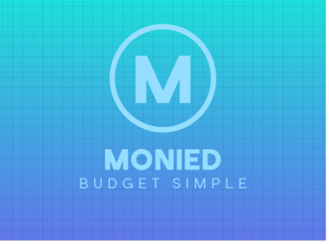

# 💰 Monied - Personal Finance & Budgeting App



## 📋 Comprehensive Project Report

### 🎯 Purpose of the App
Monied is a comprehensive, feature-rich Android application designed to empower users to take control of their personal finances. Unlike traditional budgeting tools that can feel restrictive, Monied focuses on the "why" and "how" of financial management. It combines powerful tracking tools with a unique gamification engine to make financial discipline engaging, rewarding, and sustainable. The app aims to transform budgeting from a chore into a journey toward tangible aspirations.

---

## 📱 Core Features

### 🏆 Advanced Gamification Engine
Monied turns financial management into a journey with an extensive achievement system:
- **Gamification Elements**: The app includes gamification elements such as rewards or badges for meeting budget goals or consistent expense logging.
- **Consistent Logging**: Earn special badges for maintaining streaks and logging expenses daily.
- **Goal Achievement Rewards**: Users are rewarded with exclusive badges when they successfully meet their budget goals.
- **40+ Unlockable Badges**: Categorized by behavior and milestones.
  - **Milestone Badges**: "First Step", "Active Contributor", "Centurion".
  - **Savings Badges**: "Bronze/Silver/Gold Saver" and "Savings Pro".
  - **Behavioral Badges**: "Early Bird", "Night Owl", and "Weekend Warrior".
- **Real-time Notifications**: Instant feedback via custom toasts and alerts when achievements are unlocked.

### 📊 Precision Analytics & Reporting
Visualize your financial health with interactive data tools:
- **Interactive Category Graphs**: The user is able to view a graph showing the amount spent per category over a user-selectable period. The graph also displays the minimum and maximum goals to provide clear financial context.
- **Visual Performance Tracking**: The app displays in a visual format how well the user is doing with staying between their minimum and maximum spending goals over the past month.
- **Dynamic Overviews**: Powered by **MPAndroidChart**, providing high-level spending insights and real-time comparison against targets.

### 🛡️ Smart Budgeting & Alerts
Stay on track with proactive financial monitoring:
- **Budget Alerts**: Act as real-time financial guardrails. By notifying users when they near their limits, these alerts provide the critical feedback loop needed to prevent overspending, empowering users to make informed decisions at the moment of purchase rather than regretting them later.
- **Warning System**: Receive alerts when reaching 80% of your monthly limit.
- **Over-limit Alerts**: Instant notification when a budget is exceeded.

### 🎯 Saving Goal Feature
A **Saving Goal Feature** provides the essential "why" behind budgeting. By visualizing progress toward tangible aspirations like a vacation or emergency fund, it transforms restriction into motivation, shifting the user's mindset from deprivation to achievement.
- **Visual Progress**: Real-time progress bars showing how close you are to your targets.
- **Goal Crusher Rewards**: Earn special recognition when you successfully reach a milestone.

### 🌗 Dark Mode & Light Mode
Offering both **Dark Mode and Light Mode** ensures the app is accessible and comfortable in any environment. Light mode guarantees readability in bright sun, while dark mode reduces eye strain at night, respects user preference, and meets accessibility standards. Together, these features create a holistic, engaging, and user-friendly financial tool.

---

## 🎨 Design Considerations

### 1. User Experience (UX) & Accessibility
The app is built using **Material Design 3 (M3)** components, ensuring a consistent and modern look. Key considerations include:
- **Readability**: High-contrast themes and clear typography (using Material 3 styles) for better information density.
- **Visual Hierarchy**: Important financial metrics are prioritized on the dashboard for immediate impact.
- **Responsive Layouts**: Use of ConstraintLayout and RecyclerView to handle various screen sizes and data lists efficiently.

### 2. Gamification Strategy
By integrating a badge system, the design leverages psychological rewards to encourage user retention. This shifts the focus from "spending less" to "achieving more," making the app more "sticky" and user-friendly.

### 3. Data Integrity
The hybrid storage strategy ensures that user data is persistent and consistent, even across app updates or device restarts.

---

## 🛠️ Technical Architecture

### Hybrid Data Persistence
Monied employs a sophisticated dual-layered storage strategy:
- **Manual SQLite (SQLiteOpenHelper)**: Used for core business logic and the gamification engine.
- **Room Persistence Library**: Leveraged for structured data entities and modern reactive patterns.
- **DataStore**: Used for lightweight preference management (like theme settings and user sessions).

### Modern Android Tech Stack
- **UI Framework**: Material Design 3 (M3)
- **Concurrency**: Kotlin Coroutines
- **Image Loading**: Glide
- **Navigation**: Jetpack Navigation Component

---

## 🚀 GitHub & GitHub Actions

### GitHub Utilization
The project is hosted on **GitHub**, utilizing its robust version control system to manage features, track changes, and maintain code history.
- **Branch Management**: Feature-based branching is used to ensure the `main` branch remains stable while new features (like Savings Goals or Alerts) are developed.
- **Issue Tracking**: GitHub Issues are used to manage bugs and feature requests.

### GitHub Actions
**GitHub Actions** is utilized to implement Continuous Integration (CI). Automated workflows are configured to:
- **Build Automation**: Every push to the repository triggers a build to ensure the code compiles correctly across different environments.
- **Automated Testing**: Unit tests and lint checks are executed automatically to maintain high code quality and prevent regressions before merging.
- **Release Management**: (Optional) Can be configured to automate the generation of APKs for testing.

---

## 📂 Project Structure

```text
MoniedBudgetApp/
├── .github/workflows/          # GitHub Actions CI/CD pipeline definitions
├── app/
│   ├── src/
│   │   ├── main/
│   │   │   ├── java/com/monied/budgetapp/
│   │   │   │   ├── adapters/          # RecyclerView adapters (Expense, Category, Savings, Report)
│   │   │   │   ├── data/              # Data Persistence Layer
│   │   │   │   │   ├── dao/           # Data Access Objects (Room)
│   │   │   │   │   ├── database/      # Room Database & Type Converters
│   │   │   │   │   ├── model/         # Database Entities (Expense, Category, BudgetGoal)
│   │   │   │   │   └── DatabaseHelper.kt # SQLite Logic & Gamification Engine
│   │   │   │   ├── ui/                # UI Layer
│   │   │   │   │   ├── auth/          # Authentication (Login/Register)
│   │   │   │   │   ├── fragments/     # Main Screens (Dashboard, History, Analytics, Profile)
│   │   │   │   │   ├── dialog/        # Custom Dialogs and BottomSheets
│   │   │   │   │   └── main/          # Core Feature Activities (AddExpense, Savings, Insights)
│   │   │   │   ├── utils/             # Utilities (GamificationManager, Formatting)
│   │   │   │   └── MoniedApplication.kt # Application Class & Initialization
│   │   │   ├── res/
│   │   │   │   ├── layout/            # XML Layouts for all Activities/Fragments/Items
│   │   │   │   ├── drawable/          # Vector assets and custom shapes
│   │   │   │   ├── values/            # Colors, Dimensions, Strings, and Light Theme
│   │   │   │   ├── values-night/      # Dark Mode Theme overrides
│   │   │   │   └── menu/              # Bottom Navigation and Toolbar menus
│   │   │   └── AndroidManifest.xml    # System configuration and permissions
│   │   ├── test/                      # Local JVM Unit Tests
│   │   └── androidTest/               # Instrumented UI and Integration Tests
│   ├── build.gradle.kts               # Module-level build script
│   └── proguard-rules.pro             # R8/Proguard configuration
├── gradle/                            # Gradle wrapper and configuration files
├── build.gradle.kts                   # Project-level build script
├── settings.gradle.kts                # Project structure definition
├── gradle.properties                  # Build environment properties
├── gradlew                            # Gradle wrapper script
└── README.md                          # Comprehensive documentation and report
```

---

## 📥 Getting Started

### Prerequisites
- **Android Studio**: Iguana (2023.2.1) or newer.
- **SDK**: Minimum API 24, Target API 34.

### Setup
1. Clone the repository: `git clone https://github.com/Kmakoro/MoniedBudgetApp.git`
2. Open in Android Studio and Sync Gradle.

### Demo Credentials
- **Username**: `cyril`
- **Password**: `Password@123`

---

## ▶️ Video Demo
[](https://www.youtube.com/watch?v=LWs_Zhnmngw)
